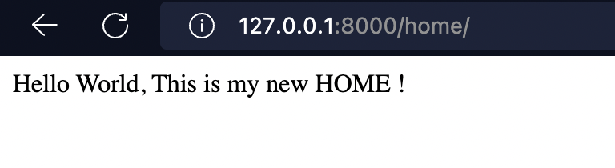

# LAB_APPS_VIEWS

## Using what you learned , Create a new Django Project . With 1 app , which has a view handling the following path : 
- [x] home/

## When requested (http://127.0.0.1:8000/home/), it should return the phrase :
- [x] Hello World, This is my new HOME !

